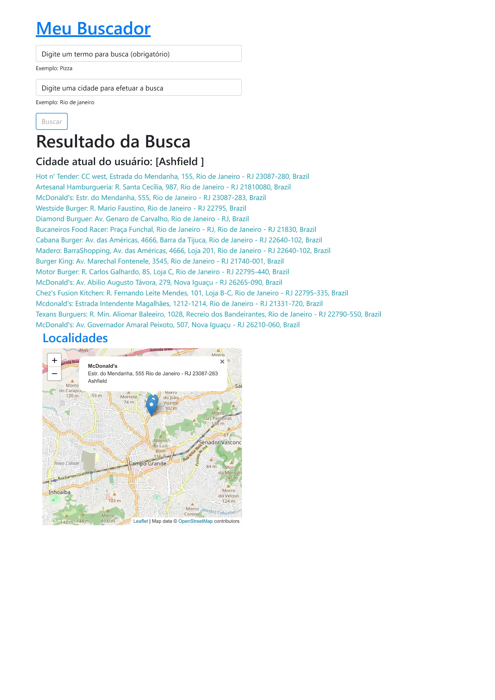
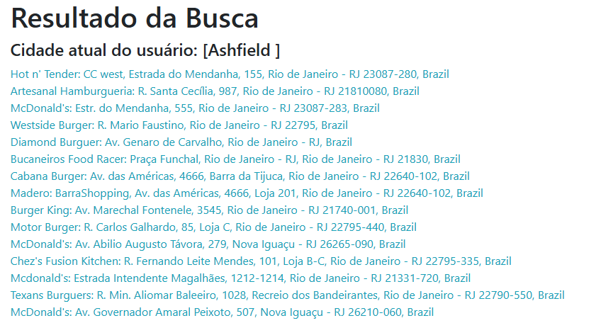
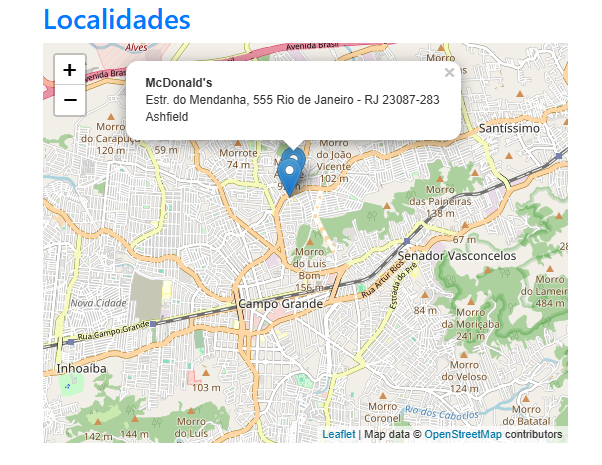
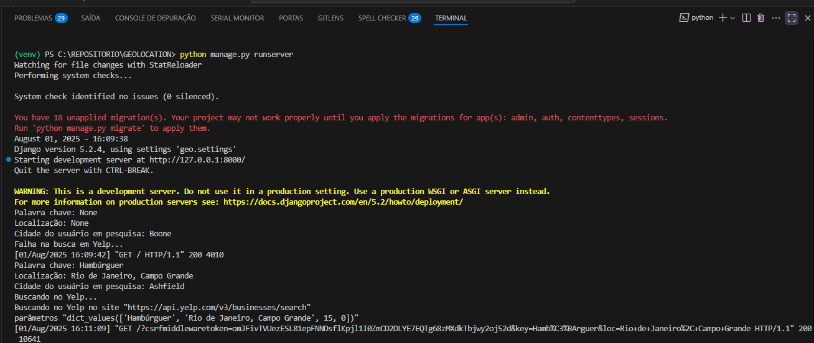

# GEOLOCATION

- Geolocalização com Django (Mapas):

- O projeto consiste em realizar busca com Ip's de usuários aleatórios (alguma cidade aleatória no mundo), para realização de uma pesquisa referente a um produto e localidade no globo terrestre, com finalidade de exibir uma lista de até 15 endereços com respectivo nome do estabelecimento.
    - Exp: McDonald's: Av. Governador Amaral Peixoto, 507, Nova Iguaçu - RJ 26210-060, Brazi

- Pagina de busca:

- Pesquise por algum produto desejada e informe uma cidade:

- A pesquisa irá apontar nome da cidade de onde usuário fez a pesquisa, lista de estabelecimento e seu respectivo endereço e aponta em um imagem de um mapa navegável os respectivos endereço.

- Seque ampliação da lista de endereço:

- Seque ampliação do mapa:

- Seque informação do terminal conforme pesquisa:

- Pagina em PDF da pesquisa [Arquivo em PDF](Imagem/PESQUISA.pdf)

- Caso cidade não for encontrada será exibido uma pesagem padrão:

- pip install django geoip2 requests django-stdimage

    - django: Framework web de alto nível para desenvolvimento rápido de aplicações web seguras e escaláveis.

    - geoip2: Permite obter a localização geográfica de um endereço IP (cidade, país, latitude/longitude).

    - requests: Fazer requisições HTTP (GET, POST, PUT, DELETE) em formato JSON.

     - django-stdimage : Extensão do campo ImageField do Django com recursos avançados para imagens.

- Roteiro para criação de projeto e aplicação Django:
    - django-admin startproject geo .
    - django-admin startapp core 

- Baixar GeoLite2.mmdb:
    - Pagina:
        - https://dev.maxmind.com/geoip/geolite2-free-geolocation-data/
    - Atanho para arquivos downloads:
        - https://github.com/P3TERX/GeoLite.mmdb

    - Arquivos GeoLite2.mmdb: É um banco de dados binário criado pela MaxMind com dados de geolocalização de endereços IP, ele contém informações como:
    🌐 - País (Brasil, EUA, etc.)
    🏙️ - Cidade (São Paulo, Nova York…)
    📍 - Latitude e longitude
    🕐 - Fuso horário
    📡 - ASN (organização dona do IP, tipo uma operadora)
    
    - Criar e salvar arquivos em pasta "geoip" na raiz do projeto 

- Pagina Yelp é uma plataforma online onde pessoas podem pesquisar restaurantes, bares, lojas, serviços e atrações em uma cidade, neste caso é utilizado para alimentar a API Django:
    - https://www.yelp.com.br/rio-de-janeiro

    - Crie um novo App (Create New App):
        - https://www.yelp.com/developers/v3/manage_app

    - Necessário extrair chave Yelp para uso de configuração do arquivo "settings.py" no projeto

- Após modelagem do Banco de Dados em "__models.py__" aplicar comando para criar scripts de migração: 
    - python manage.py makemigrations

- Aplica as mudanças no Banco de Dados com:
    - python manage.py migrate

- Iniciar execução do Django dentro da pasta do projeto:
    - python manage.py runserver

- Arquivo:
    - core:
        - templates:
            - __base.html__: Pagina HTML
            - __index.html__: Pagina HTML
            - __maps.html__: Pagina HTML
        - __utils.py__: Uso de geolocalização (__GeoLite2-City.mmdb__ e __GeoLite2-City.mmdb__) e YELP_API_KEY
        - __views.py__: Requisições para templates (Paginas HTML) e geolocalização (__utils.py__)
        - __core_urls.py__: Rotas da apalicação (__views.py__)
    - geo:
        - __settings.py__: Configuração de Geolocalização
        - __urls.py__: Gerenciador de rotas das aplicações (__core_urls.py__)
    - geoip:
        - __GeoLite2-City.mmdb__: Arquivo binario de geolozalização
        - __GeoLite2-City.mmdb__: Arquivo binario de geolozalização
    - __.env__: Variáveis de ambiente (utilize env.txt como parâmetro)

